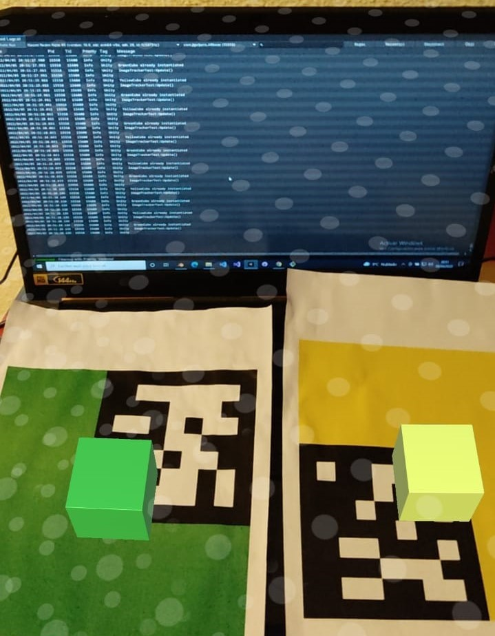

# Augmented Reality TFT

Diseño y desarrollo de un videojuego con realidad aumentada en sistemas Android

 
 

<!-- SHOULD I INCLUDE INPUT MANAGER INFO? SCREENSHOT IN DOC -->
 ## v0.2 Módulo de seguimiento multi-imagen   
 ---

En esta rama de desarrollo se genera un script y configuraciones para que el proyecto sea capaz de detectar múltiples imágenes e instanciar objetos dependiendo de cada una

 
 

### Desarrollo del módulo
---
En este módulo hemos creado un Script sobre un GameObject desechable a futuro "ImageTrackerLoader", este GameObject nos permite lanzar el script "ImageTrackerTest.cs" una vez se inicia la escena, con este Script conseguimos es cambiar el funcionamiento por defecto del componente AR Image Tracker, el cual instancia un solo prefab al desubrir una imagen detectada. Con nuestro nuevo funcionamiento la aplicación es capaz de distinguir entre diferentes imágenes detectadas con la cámara e instanciar un objeto en la posición de estas imágenes.

FALTA AÑADIR LO DE LAS IMÁGENES, SU PUNTUACIÓN, ETC..

<figure>

<figcaption align = "center">Both prefabs spawned and Android Logcat Debug shown in screen</figcaption>
</figure>

 
 

### Herramientas y componentes añadidos
---
 

- Componente Audio Listener (A futuro)
- [SerializedDictionaryLite](https://assetstore.unity.com/packages/tools/utilities/serialized-dictionary-lite-110992)  
    - Herramienta que permite serializar diccionarios en la plataforma para un manejo más visual del diccionario

 
 

### Build

Si requieren de una build para testear este proyecto los requisitos necesarios son disponer de un sistema Android que posea al menos la versión Android 7.0 Nougat. Debido al tamaño de la .apk me es imposible subirla a GitHub pero pueden pedirme una copia contactándome a alguno de los siguientes emails:

joseluisguijarrorubio@alumnos.upm.es
joseluisguijarrorubio@gmail.com

